# FX Quantitative Risk Engine

[](https://github.com/mannankhanduja-max/FX-Quantitative-Risk-Engine/actions/workflows/ci.yml)

Volatility modelling, Value at Risk with formal backtesting, Monte
Carlo simulation and stress testing against dated historical
episodes — run on **4,918 trading days of real market data**,
February 2007 to September 2026.

> **Backtest-only.** Every number this repository produces is
> computed on historical data. None of it is a prediction, a
> recommendation, or investment advice. See
> [§10 Backtest-only results](#10-backtest-only-results) before
> quoting anything from here.

---

## 1. What this is

Most published portfolio projects estimate risk from a sample
covariance matrix and stop. That has two problems, and this
repository is organised around fixing them.

**A sample covariance matrix has no memory of when things
happened.** It weights a return from five years ago exactly as
heavily as yesterday's. Volatility clusters and correlations move,
so the equal-weighted estimate describes an average of regimes
rather than the one you are in.

**Nobody checks whether the risk number was right.** A VaR
estimate is a falsifiable claim: at 99%, losses should exceed it on
1% of days, and those breaches should be scattered rather than
bunched. That is testable, and untested VaR is decoration.

So:

| Instead of | This uses |
|---|---|
| Sample covariance | EWMA (RiskMetrics, λ = 0.94) and DCC-GARCH |
| Constant volatility | GARCH(1,1) with Student-t innovations |
| Correlation ignored in VaR | DCC covariance contracted with weights |
| Unverified VaR | Kupiec, Christoffersen, Basel traffic light, Lopez loss |
| No tail analysis | Expected Shortfall alongside every VaR |
| Daily bars, no volume | ETF bars with real volume: 20-day VWAP, 9-period EMA |
| sqrt-time for multi-day risk | Monte Carlo through the variance recursion |
| "What if markets fall 10%" | Dated replays: Lehman, SNB, CNY, Brexit, COVID, LDI |

---

## 2. Quick start

```bash
python -m venv venv && source venv/bin/activate
pip install -r requirements.txt

# One download. Everything after it is offline and reproducible.
python fetch_data.py --start 2006-01-01

python run_risk_report.py --source yahoo
python docs/make_figures.py --source yahoo

pytest tests/ -q
```

`fetch_data.py` is the only step that touches the network. It writes
one CSV per instrument into `data/yahoo/`, and every later run reads
that cache — so a vendor revision or a rate limit cannot silently
change a backtest you already ran.

The intraday strategy in §5a uses a different source and its own
download step, because Yahoo cannot support it at all:

```bash
pip install dukascopy-python
python fetch_intraday.py       # Dukascopy 15m bars into data/intraday/
python breakout_test.py
```

`python run_risk_report.py --demo` runs the whole pipeline on
simulated data if you want to check the machinery without
downloading anything. Its output is labelled `DEMO_SIMULATED_`.

**The figures in this README are real.** 4,918 trading days,
February 2007 to September 2026.


### What it finds

At 99% over the full sample, the estimators separate cleanly:

| method | breaches (exp. 46) | Kupiec p | Christoffersen p | |
|---|---|---|---|---|
| `dcc_portfolio` | 49 | 0.57 | 0.56 | **pass** |
| `garch_t` | 49 | 0.74 | 0.54 | **pass** |
| `historical` | 51 | 0.31 | 0.003 | fail |
| `parametric_normal` | 60 | 0.02 | 0.001 | fail |
| `ewma_normal` | 76 | 0.0003 | 0.49 | fail |

`ewma_normal` is the instructive one. It **passes** the independence
test and fails coverage badly — 76 breaches against 48.9 expected. It
gets the volatility right and the tail shape wrong, which is exactly
what a Gaussian quantile on fat-tailed returns should do. `historical`
does the reverse: roughly the right count, clustered in the wrong
places.

Monte Carlo at 99%, 20,000 paths: 1-day VaR **1.41%**, 10-day
**4.33%**. Square-root-of-time scaling would say 4.46% — a ratio of
**0.971**, so the iid assumption overstates ten-day risk here.

---

<figure>
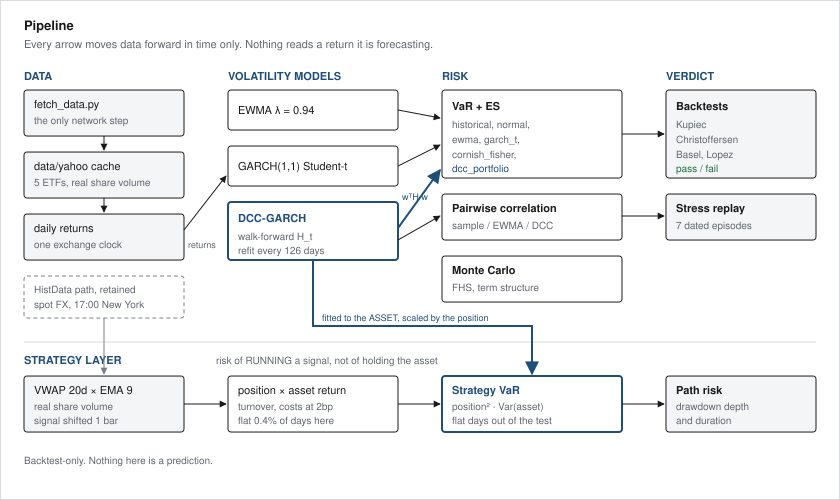
<figcaption><sub>Pipeline: the Yahoo cache of ETF bars becomes daily returns on one exchange clock, feeds three volatility models, and drives VaR, backtests, correlation and stress replay. A second row applies the VWAP/EMA signal and measures strategy risk, fitting the variance model to the asset and scaling it by the position.</sub></figcaption>
</figure>

---

## 3. What the models do

### EWMA — `fxrisk/models/ewma.py`

    sigma2_t = lambda * sigma2_{t-1} + (1 - lambda) * r_{t-1}^2

λ = 0.94 is the RiskMetrics daily default, a ~17-day centre of mass.
Provides variance, full covariance paths, correlation, and a
portfolio variance path that avoids materialising every matrix.

<figure>
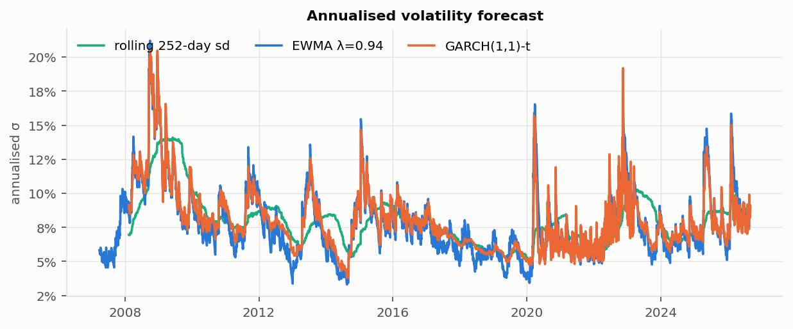
<figcaption><sub>Three volatility estimates on the equal-weight ETF portfolio, 2007-2026. The rolling 252-day standard deviation steps when a shock enters and leaves the window; EWMA and GARCH respond on the day.</sub></figcaption>
</figure>


### GARCH(1,1) — `fxrisk/models/garch.py`

    sigma2_t = omega + alpha * eps_{t-1}^2 + beta * sigma2_{t-1}

Maximum likelihood via SLSQP, Gaussian or Student-t innovations,
with stationarity enforced as a constraint. Written directly rather
than wrapping the `arch` package so the likelihood, constraints and
forecast recursion are visible and testable — the test suite
recovers known parameters from simulated data.

Student-t is the default. Gaussian GARCH systematically
understates tail risk, which is the one thing a VaR engine must not
do.

`rolling_garch_variance` produces walk-forward one-step-ahead
forecasts: at each date the model has only seen returns strictly
before it. Refits periodically and recurses daily in between, which
is what a desk actually does.

<figure>
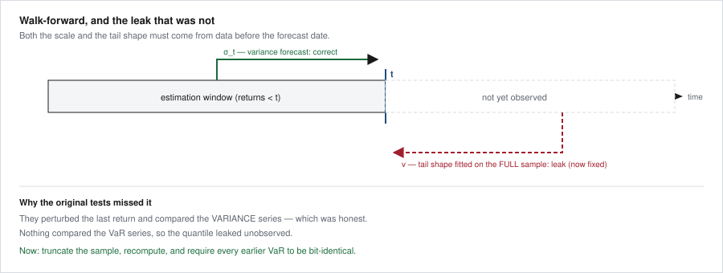
<figcaption><sub>The forecast for day t may only use returns before t. The leak that was fixed: the Student-t degrees of freedom were fitted on the whole sample, so the scale was honest and the tail shape was not.</sub></figcaption>
</figure>


### DCC-GARCH — `fxrisk/models/dcc.py`

Engle's two-stage estimator. Univariate GARCH per asset, then

    Q_t = (1 - a - b) Qbar + a z_{t-1} z_{t-1}' + b Q_{t-1}

normalised to a correlation matrix. This separates correlation
dynamics from volatility dynamics, which EWMA cannot do — EWMA
forces both to share one decay factor.

Correlations rise in crises. A static matrix estimated over a calm
decade understates portfolio risk in exactly the state where the
number carries weight.

`rolling_dcc_covariance` is the walk-forward version, and it is the
one the VaR path uses. `fit_dcc` sees the whole panel, so its
correlation path cannot be used for a backtest without leaking the
future into every historical date. Refits are semi-annual by
default rather than monthly — each fit runs one MLE per asset plus
a likelihood optimisation over the window, so daily refitting is
not tractable.

Stated limits: two-stage DCC is consistent but not efficient,
stage-2 standard errors ignore stage-1 estimation error, and the
scalar (a, b) form makes every pair share the same correlation
dynamics.

### VaR and ES — `fxrisk/risk/var.py`

Six estimators, because the disagreement between them is
informative: `historical`, `parametric_normal`, `ewma`, `garch_t`,
`cornish_fisher`, and `dcc_portfolio`. Plus portfolio VaR from any
covariance matrix and a component-VaR decomposition that answers
where the risk actually sits.

`dcc_var_series` is what makes DCC load-bearing rather than
decorative. The other estimators model the volatility of the
*portfolio return series*, so a change in correlation between
constituents only reaches the risk number after it has already
shown up in realised portfolio volatility. This one forecasts the
covariance matrix asset by asset and contracts it with the weights,

    sigma2_p,t = w' H_t w

so a correlation regime shift moves VaR on the day the model
detects it rather than after the portfolio has lived through it.

<figure>
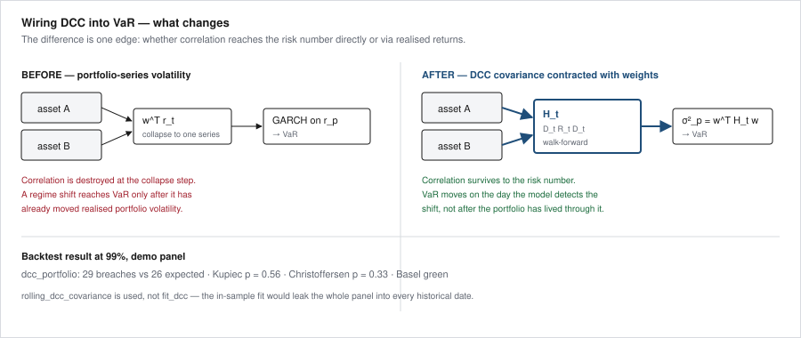
<figcaption><sub>Collapsing to a portfolio return series destroys the correlation information before it reaches the risk number. Contracting the DCC covariance with the weights preserves it.</sub></figcaption>
</figure>


Expected Shortfall accompanies every VaR — Basel's FRTB replaced
99% VaR with 97.5% ES as the capital measure, because VaR says
nothing about how bad the tail gets once you are in it.

The Gaussian estimator is included specifically as a baseline that
should fail. Demonstrating that is the point.

<figure>
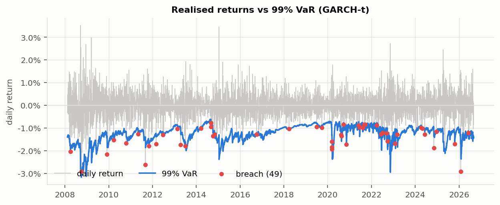
<figcaption><sub>Realised daily returns against the 99% GARCH-t VaR line over 4,918 trading days. The line widens through 2008, the January 2015 SNB break, March 2020 and 2022, and the 49 breaches are scattered rather than bunched.</sub></figcaption>
</figure>


### Backtesting — `fxrisk/risk/backtesting.py`

- **Kupiec (1995)** unconditional coverage — right *number* of breaches?
- **Christoffersen (1998)** independence — are breaches *scattered* or clustered?
- **Conditional coverage** — joint test
- **Basel traffic light** — the supervisory rule, 99% only
- **Lopez loss** — magnitude-aware score

The independence test is what separates a serious engine from a
toy. Historical VaR typically passes Kupiec and fails
Christoffersen: it has the right average and is wrong at the moments
that matter. That failure is the entire argument for GARCH.

<figure>
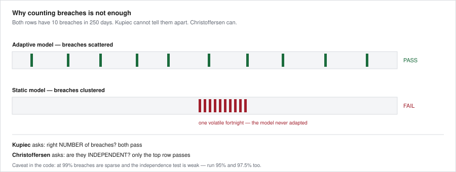
<figcaption><sub>Two models, ten breaches each in 250 days. Kupiec cannot tell them apart; Christoffersen fails the one whose breaches arrive in a single volatile fortnight.</sub></figcaption>
</figure>


Two properties documented in the code because they change how you
read the output:

*The independence test is weak when breaches are sparse.* At 99%
over 3,000 days you get ~30 breaches, and simulation shows the test
rejects a deliberately misspecified flat VaR less than half the
time. At 95% (~150 breaches) power rises above two thirds. A pass at
99% alone is weak evidence — the runner backtests at 95%, 97.5% and
99% for this reason.

*Basel zones apply only at 99%.* A correct 95% model breaches ~12
times per 250 days and would be scored "red" for working properly.
Other confidence levels return `n/a` rather than a misleading
colour.

<figure>
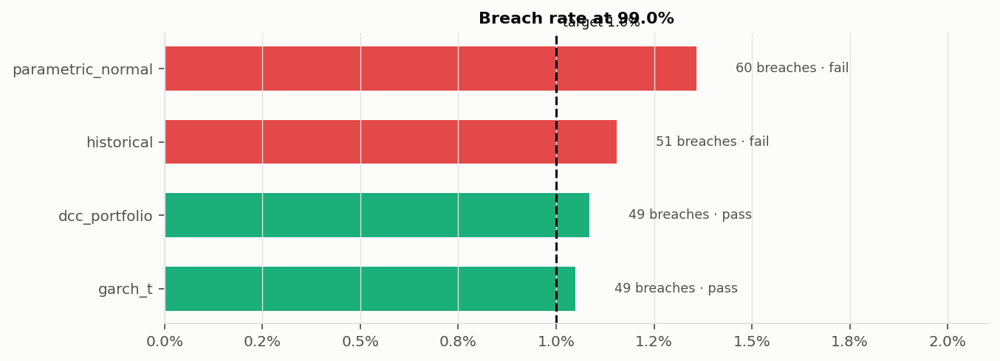
<figcaption><sub>Breach rate per estimator at 99% against the 1% target, on real data. The two conditional fat-tailed models land near the target; the historical and Gaussian baselines do not.</sub></figcaption>
</figure>


### Pairwise correlation — `fxrisk/risk/correlation.py`

`pairwise_table` puts three estimates of every instrument pair side
by side: the full-sample Pearson correlation, the EWMA value at the
end of the sample, and the DCC path's last / mean / min / max. The
column that matters is `dcc_range` — max minus min — because that is
precisely what the single sample number averages away.

<figure>
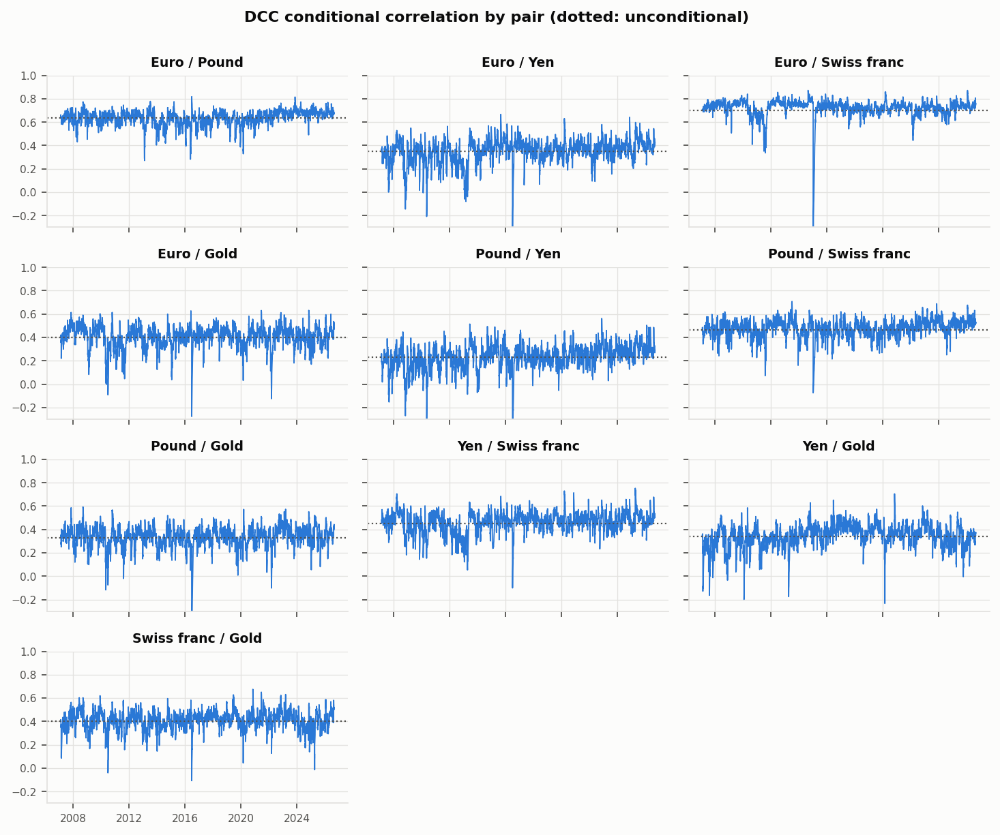
<figcaption><sub>All ten pairwise DCC correlations against their unconditional levels (dotted). Euro/Swiss franc sits near 0.72 and collapses toward zero on the day the SNB removed the floor.</sub></figcaption>
</figure>

`correlation_stress` splits the sample on portfolio-average return
and reports each pair's mean conditional correlation on the worst
5% of days against all others. A positive `increase` means
diversification weakens exactly when it is needed, which is the
empirical case for using a conditional correlation model at all.

<figure>
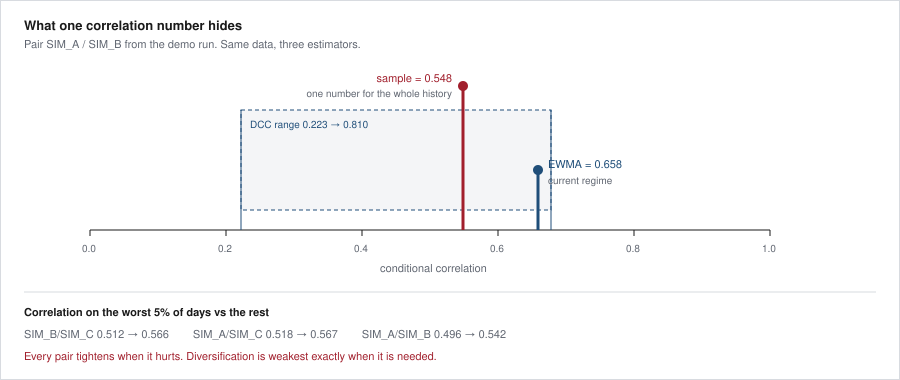
<figcaption><sub>One sample correlation of 0.548 stands in for a DCC path running 0.223 to 0.810 — and every pair tightens further on the worst 5% of days.</sub></figcaption>
</figure>


### Risk-adjusted performance — `fxrisk/risk/performance.py`

Sharpe, Sortino, Calmar, drawdown and rolling Sharpe, plus a
per-instrument table. Two things it is deliberately explicit about:

*The risk-free rate is annual and is de-annualised before use.*
Subtracting an annual 4% from a daily return is a factor-252 error
and a common one. Every function here takes the annual rate and
converts it geometrically.

*Sortino measures downside against the minimum acceptable return,*
not against zero. Using zero is common and wrong whenever the
risk-free rate is non-zero, and it makes Sortino non-comparable
with the Sharpe printed beside it.

`sharpe_ratio` also returns the un-annualised value, so the
sqrt-time assumption behind annualisation stays visible rather than
buried.

<figure>
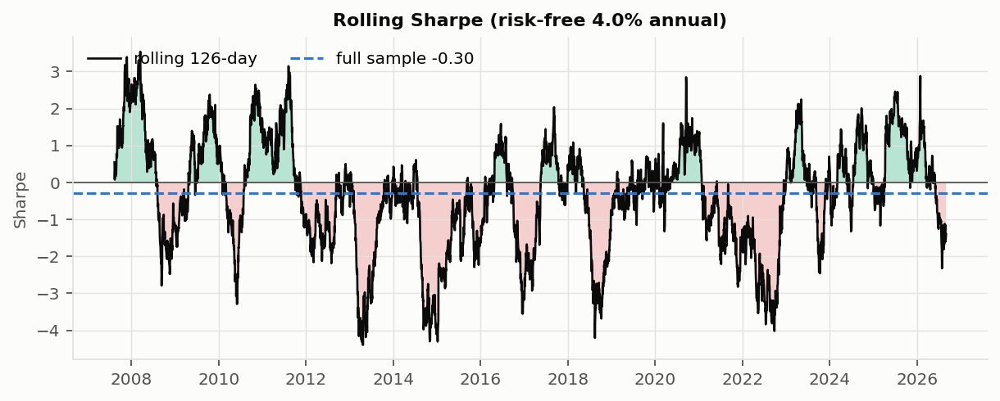
<figcaption><sub>Rolling 126-day Sharpe against the full-sample value, real ETF data.</sub></figcaption>
</figure>


<figure>
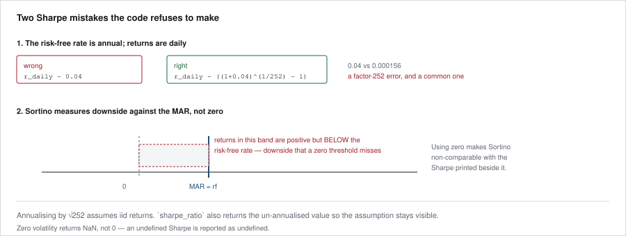
<figcaption><sub>An annual risk-free rate subtracted from daily returns is a factor-252 error; and a zero downside threshold misses returns that are positive but below the risk-free rate.</sub></figcaption>
</figure>


### Stress testing — `fxrisk/risk/stress.py`

Dated windows replayed against current weights:

| Key | Episode | Window |
|---|---|---|
| `gfc_2008` | Lehman | 2008-09-01 → 2008-12-31 |
| `gfc_full` | Full GFC drawdown | 2007-10-09 → 2009-03-09 |
| `snb_2015` | SNB abandons the EUR/CHF floor | 2015-01-12 → 2015-01-30 |
| `cny_2015` | CNY devaluation, August selloff | 2015-08-10 → 2015-09-30 |
| `brexit_2016` | Referendum | 2016-06-20 → 2016-07-15 |
| `covid_2020` | COVID crash | 2020-02-19 → 2020-03-23 |
| `gilt_2022` | UK gilt / LDI crisis | 2022-09-21 → 2022-10-17 |

`snb_2015` is the one that matters most for FX. The Swiss National
Bank abandoned its 1.20 floor without warning on 15 January 2015 and
EUR/CHF fell ~30% intraday. Years of near-zero measured volatility
followed by a move no VaR model calibrated on that history could
have anticipated — the cleanest available demonstration of what
these models cannot do.

Scenarios outside your data window are **skipped and reported as
skipped**. Assets missing from a window are reported with a coverage
percentage rather than silently zero-filled: a stress result
computed over half the book is worse than none, because it looks
complete.

`stress_vs_var` expresses each scenario's worst day as a multiple of
current VaR — the framing that lands in a risk meeting.

### Strategy risk — `fxrisk/risk/strategy.py`

Everything above measures the risk of **holding** these
instruments. This measures the risk of **running a signal** on
them, which is a different object:

    r_strat(t) = position(t) * r_asset(t),   position known at t-1

Two consequences follow, and both are easy to get wrong.

**The conditional variance belongs to the asset.** Because the
position is known at t−1 it is a constant inside the time-t
conditional distribution, so

    Var(r_strat | F_t-1) = position^2 * Var(r_asset | F_t-1)

The volatility model is therefore fitted to the **asset** and its
output scaled by the position. `strategy_var_series` does that.
`naive_strategy_var_series` fits GARCH to the strategy series
instead — the common error — and is kept so the difference can be
measured rather than asserted.

**Flat days must leave the backtest.** When the signal is flat the
return is exactly zero and so is the VaR, which makes a breach
impossible rather than merely unlikely. Leaving those days in
inflates Kupiec's expected breach count while the achievable count
is unchanged, so a correctly calibrated model gets rejected for a
reason that has nothing to do with the model. `compare_var_construction`
excludes them by default. The cost — stated, not hidden — is that
Christoffersen then reads *consecutive in-market days* rather than
consecutive calendar days.

#### The result, and it is a negative one

On the simulated series in the tests, at a 35% flat share, the
naive construction degenerates badly: the fitted degrees of freedom
fall from 200 to 2.4, persistence is driven to the IGARCH boundary
where shocks never decay, and the resulting 99% VaR is 1.18× to
1.79× the correct one across ten seeds.

On **this repository's actual VWAP/EMA signal, none of that
happens.** `sign(ema_gap)` is almost never exactly zero, so the
strategy is flat on well under 1% of days and holds ±1 the rest of
the time. With no meaningful point mass, the two fits are
indistinguishable:

| | flat | asset ν / α+β | strategy ν / α+β |
|---|---|---|---|
| FXE | 0.40% | 10.20 / 0.9972 | 9.78 / 0.9973 |
| FXB | 0.39% | 8.07 / 0.9920 | 7.84 / 0.9920 |
| FXY | 0.41% | 5.11 / 0.9921 | 4.97 / 0.9933 |
| FXF | 0.39% | 6.63 / 0.9893 | 6.47 / 0.9893 |
| GLD | 0.38% | 5.47 / 0.9948 | 5.28 / 0.9951 |

Degrees of freedom differ by 2–3%; persistence agrees to three or
four decimals. On FXE the two VaR series backtest at 56 breaches
against 51, both passing coverage and independence.

So for a continuously-invested ±1 signal this distinction is a
distinction without a difference. The machinery earns its place on
strategies genuinely **out** of the market a material share of the
time — a long-only rule with a trend filter, regime gating, a
volatility target that goes to cash — and saying so is more useful
than shipping something that never fires without mentioning it.

#### The short leg was never executable

Paper trading found this on its first submission, and it is the
most consequential thing in this section.

The strategy holds ±1 at all times, which assumes both directions
are available. They are not. Four of the five instruments **cannot
be sold short** — Alpaca rejects the order outright with
`asset "FXE" cannot be sold short`, because the small currency
ETFs are not on the easy-to-borrow list. Only GLD went through.

| | short days | share | shortable |
|---|---|---|---|
| FXE | 2,503 | 48.2% | no |
| FXB | 2,619 | 51.6% | no |
| FXY | 2,292 | 46.6% | no |
| FXF | 2,624 | 51.7% | no |
| GLD | 2,875 | 55.3% | yes |

**39.4% of all instrument-days in this repository's backtest are
positions that could never have been opened.** Not mispriced —
impossible.

`config.Instrument` now carries a `shortable` flag and
`paper_trade.py` clamps those names to long-or-flat rather than
submitting orders certain to be rejected. The backtest deliberately
does **not** clamp, because rewriting history to match today's
borrow list would hide the problem rather than record it; the
figures above and below are the unclamped ones, and should be read
knowing that roughly two-fifths of them are fictional.

Long-only versions of the same rule do look better — GLD goes from
−50.5% to +128.8% — but that is not an edge appearing. It is beta:
gold rose over the sample, and a rule that is long some of the time
captures part of that. Removing the short leg from a losing
strategy on a rising asset will always flatter it.

Borrow availability varies by broker and over time, so this records
what was rejected on 12 September 2026 rather than a permanent
property of the assets.

#### What real data does show: the path risk

| | max drawdown | under water | annualised |
|---|---|---|---|
| FXE | −40.78% | 99.4% | — |
| FXB | −37.47% | 98.8% | −1.30% |
| FXY | −29.41% | 98.7% | −0.52% |
| FXF | −34.72% | 97.6% | +0.57% |
| GLD | −62.40% | 99.4% | −3.35% |

Four of five lose money and all five spend essentially the whole
sample below their prior peak. **This signal has no edge**, and the
numbers above are still optimistic: its parameters were chosen over
this same sample, so the backtest-only warning in §10 binds harder
here than anywhere else in this repository.

That is why `drawdown_profile` reports duration and time under
water rather than depth alone. A 12% drawdown recovered in three
weeks and a 12% drawdown that takes fourteen months are the same
number and a completely different experience — only one of them
ends a mandate. And it is why the strategy layer sits here at all:
the point was never to present a profitable rule, but to measure
one honestly enough to establish that it is not.

---

---

## 4. Real data

**The default path is Yahoo Finance.** `python fetch_data.py`
downloads daily bars for the five ETFs in §5 and writes them to
`data/yahoo/`. That is the only step that touches the network; every
report afterwards reads the cache, so results are reproducible and
the figures in this README were generated from it.

### The Dukascopy path

Used only by the intraday strategy in §5a, and chosen because
Yahoo fails it three ways over: no volume on FX spot (so no VWAP
is definable), no spot gold and no Nasdaq-100, and a trailing
60-day ceiling on 15-minute bars. Dukascopy gives spot EUR/USD,
spot gold, the Nasdaq-100 index and spot USD/JPY, with a tick
count per bar and an archive back to 2003.

The volume figure is a TICK COUNT, not contracts — in spot FX
there is no consolidated tape, so traded volume does not exist.
That makes the VWAP here activity-weighted rather than
share-weighted, which is the same convention `histdata.py`
already uses. §5a says more.

```bash
pip install dukascopy-python
python fetch_intraday.py --years 2
python fetch_intraday.py --check
```

### The HistData path

Retained for spot FX, and the reason `fxrisk/data/histdata.py`
exists. It is exercised only when `config.UNIVERSE` is switched to
one of the spot books.

[HistData.com](https://www.histdata.com/download-free-forex-data/)
provides free tick and 1-minute FX history. Download the ASCII
archives, unzip one folder per pair:

```
data/histdata/EURUSD/DAT_ASCII_EURUSD_M1_2015.csv
data/histdata/EURUSD/DAT_ASCII_EURUSD_T_201501.csv
```

then

```bash
python run_risk_report.py --data-dir data/histdata
```

### The volume problem, stated plainly

**The Volume column in every HistData file is zero.** Spot FX trades
over the counter with no consolidated tape, so there is nothing to
report; the column exists for format compatibility.

This matters because a volume-weighted average price needs volume.
Two substitutes, both implemented:

- **Tick count** — quote updates per bar. Quote intensity tracks
  activity closely in FX, so a tick-count-weighted average price is
  a genuine VWAP analogue. Requires tick files. This is the
  supported path.
- **Time weighted** — with only M1 bars every bar weighs the same,
  which makes the result a TWAP.

`rolling_vwap` will not fabricate volume. Given M1 bars it returns a
TWAP, names the series `twap`, and emits a `RuntimeWarning`. A TWAP
is a legitimate benchmark; calling it a VWAP is not.

<figure>
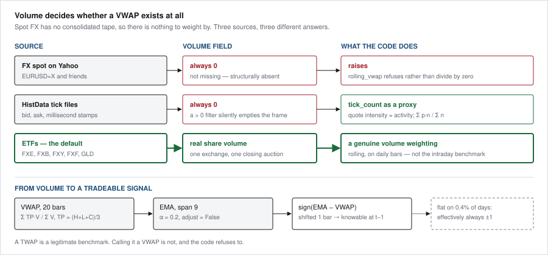
<figcaption><sub>Volume decides whether a VWAP exists at all. FX spot on Yahoo and HistData both report zero, so rolling_vwap raises rather than divide by zero and the tick path substitutes a tick-count proxy. ETFs report real share volume, which is the default and what the 20-day VWAP, its 9-period EMA and the one-bar-shifted signal are built from.</sub></figcaption>
</figure>


### The session boundary

FX has no exchange close, so the daily boundary is a choice.
`to_daily` cuts at 17:00 New York — the market convention — rather
than letting the default land at UTC midnight, in the middle of the
Asian session. This is the difference between a daily return series
that means something and one that does not.

---

## 5. The instrument universe

Defined once, in `config.py`, and read by both pipelines — so the
two halves of this repository describe the same book.

| Instrument | Symbol | Exposure | History from |
|---|---|---|---|
| Euro | `FXE` | EUR/USD | 2005-12 |
| Pound | `FXB` | GBP/USD | 2006-06 |
| Yen | `FXY` | JPY/USD | 2007-02 |
| Swiss franc | `FXF` | CHF/USD | 2006-06 |
| Gold | `GLD` | XAU/USD | 2004-11 |

These are exchange-traded currency and metal funds, not spot FX.
Both pipelines read `config.UNIVERSE`; neither holds its own list,
and a test fails if they drift apart. `fetch_data.py` is the only
step that touches the network — everything downstream reads the
local cache, so a report is reproducible offline.

### Why ETFs rather than spot

**One clock.** Spot FX trades 24×5 and the daily "close" is
whatever cut the vendor chose; equities and ETFs close together at
16:00 New York. Non-synchronous closes bias measured correlations
toward zero — the Epps effect — and a correlation model is the one
thing this repository is built around. On a single exchange clock
the covariance is measured on returns that actually overlap.

**Real volume.** Yahoo reports `Volume = 0` on FX spot, so a VWAP
computed from it is either a division by zero or a TWAP wearing a
VWAP's name. `fxrisk/indicators.py` raises rather than fabricate a
weight. ETFs report actual share volume, so the 20-day VWAP and its
9-period EMA in §3 are genuine.

**Gold without losing 2008.** `GLD` lists in November 2004, so gold
sits in the default book. The binding constraint is `FXY` at
2007-02, which is where the usable sample starts: Lehman, the SNB
floor, the 2015 CNY devaluation, Brexit, March 2020 and the 2022
LDI episode are all inside it. The spot path had the opposite
trade — `XAUUSD` starts 2009-03 and adding it truncated the sample
past the 2008 scenarios entirely.

**What you give up.** An ETF is not the underlying. Each carries an
expense ratio and tracking error, so multi-year *levels* drift from
the cross even though daily *returns* track closely; and the bars
stop at the equity close, so an overnight FX gap lands inside the
next day's return rather than its own.

### Two things worth knowing about this book

**These are not five independent risks.** `FXE`, `FXB`, `FXY` and
`FXF` are all dollar crosses, and `FXE`/`FXF` have historically been
close to mirror images. DCC reports that as high conditional
correlation, which is correct — but an equal-weight portfolio across
these five is less diversified than "five instruments" suggests. The
pairwise table in §3 is the place to look before assuming otherwise.

**GBP/JPY has no direct ETF.** It can be built synthetically as
`FXB / FXY` — both are quoted per USD, so the ratio is the cross,
and both trade on the same clock with real volume. It is off by
default (`config.SYNTHETIC_CROSSES`) because the two expense ratios
compound into the level.

### Switching universes

The spot books are retained for the HistData path, where local tick
files are the only source and the 17:00 New York cut is a deliberate
choice rather than a vendor default:

```python
# config.py
UNIVERSE = UNIVERSE_ETF       # default: one clock, real volume, from 2007-02
# UNIVERSE = UNIVERSE_FX      # spot FX via HistData, back to 2002
# UNIVERSE = UNIVERSE_FX_GOLD # spot plus gold, sample starts 2009-03
```

Nothing downstream hard-codes a symbol, so changing that one line
changes the whole report — including which stress scenarios are in
range.

---

---

## 5a. Intraday breakout / retracement (2:1, breakeven stop)

A second strategy, on 15-minute bars, separate from everything
above. The daily engine asks *how much can this book lose*; this
asks *does one specific entry rule make money*. They share the
cost model, the barrier walk and the ethic, and nothing else.

### The rule

```
1  TREND      9-period EMA of the session VWAP above the VWAP
              (long bias) or below it (short bias)
2  BREAKOUT   a bar CLOSES beyond the prior 20-bar high / low,
              in the direction of the bias
3  RETRACE    within 12 bars, price pulls back 33%-100% of the
              breakout impulse
4  ENTRY      first close back beyond the breakout bar's extreme
5  BRACKET    stop at the retracement extreme (floored at 1 EWMA
              sigma), target at 2x that distance, stop moves to
              breakeven once price has travelled 10 pips
```

Longs and shorts are symmetric.

```bash
pip install dukascopy-python
python fetch_intraday.py                 # the only step needing internet
python breakout_test.py
python breakout_test.py --no-breakeven   # the control
python breakout_test.py --no-trend       # is the VWAP filter earning its place?
python breakout_test.py --sweep          # parameter neighbourhood
```

### The data source is Dukascopy, and that is the whole reason this works

Yahoo cannot support this strategy, for three separate reasons,
any one of which is fatal:

- **No volume.** Yahoo reports `Volume = 0` for every FX spot
  symbol, which makes a VWAP undefined rather than merely noisy.
  `indicators.rolling_vwap` already raises rather than hand back
  a TWAP under a false name, and the session VWAP here refuses
  for the same reason.
- **No instruments.** No spot gold, no Nasdaq-100 index. Both
  would have to be proxied by ETFs or futures.
- **Sixty days.** Yahoo serves a trailing 60-day window of
  15-minute bars and nothing behind it — a few dozen trades, and
  no possibility of a held-out test.

Dukascopy fixes all three. The instruments are the instruments:
`EUR/USD`, `XAU/USD`, `E_NQ-100`, `USD/JPY` — spot, spot, the
index, spot. Nothing is quoted backwards, nothing rolls between
contracts, and the archive reaches back to 2003 for the majors.

**What the volume figure actually is.** It is a TICK COUNT: the
number of price updates inside the bar. In spot FX there is no
consolidated tape, so traded volume does not exist — any source
offering you spot FX volume is giving you one venue's slice, or a
tick count under a better name. A tick-weighted VWAP is a real
and precise object, the average price weighted by how busy the
market was, and it is the convention `histdata.py` already uses,
so the two intraday paths agree. It is *not* a share-volume VWAP
and is not described as one anywhere in this code.

The feed is Dukascopy's own, not the whole market, and it will
not match another broker's tick count bar for bar.

**Bars are bid-side.** A long fills on the ask, above the
recorded high, and that spread is not in the bar data at all.
`BREAKOUT_COST_BP` is set to 1.0 per side to cover it — wider
than a quiet-hour EUR/USD spread, deliberately, because spreads
widen exactly when breakouts happen and a stop is a market order
into the move that triggered it. `--cost-bp` makes the
sensitivity measurable rather than assumed.

### Three other things that had to be decided, not assumed

**"10 pips" is not a unit.** It means four different things
across these instruments, so each is converted to basis points of
entry price at a reference level, with the arithmetic written out
in `config.py`. They land between 4.2bp (gold) and 9.3bp
(EUR/USD) — which also means the four are *not* the same trigger
in risk terms. 9.3bp of EUR/USD is a much larger move, in that
instrument's own volatility, than 5.0bp of NAS100.

**The breakeven stop arms at the close, never inside the bar.**
A bar that touches the trigger and reverses in the same fifteen
minutes takes the original stop. Arming on the intrabar high
converts losers into scratches for free, and is the specific bug
that makes this family of rule look like it works. There is a
test for it.

**Overlapping entries are dropped.** A rule that fires on
consecutive bars in a trend produces entries that sit on top of
one another, and counting each at one unit of risk silently
levers the book — three overlapping trades is three units at
risk, not one. `walk_explicit` drops them and reports the count.

### The breakeven stop is a trade, not a free lunch

It is sold as risk reduction, and it does remove weight from the
losing tail. It also removes weight from the winning tail,
because a trade that would have run to target now gets scratched
on the retest. On a synthetic random walk — where true expectancy
is exactly minus costs, so any apparent improvement would be a
bug — the rule moved the win rate from 30% to 15% and left total
R essentially unchanged. That is the correct answer, and it is
why `--no-breakeven` exists as a control rather than an
afterthought.

Whether it helps on real data depends on how often price that
travels 10 pips comes back through entry before reaching target.
That is a property of the instrument, not of the rule, and it is
measurable rather than arguable.

### What to read in the output, and in what order

Not the total R. The **win rate against the cost-adjusted
hurdle**. At 2:1 the folklore number is 33.3%, but the round trip
is paid whether the trade wins or loses, and in units of risk
that is `cost_R = 2 * cost / stop_distance` — so the real hurdle
is `(1 + cost_R) / (1 + rr)`. This rule sets its stop from market
structure rather than a constant, so the hurdle differs on every
trade and the figure printed is the average.

Then the **t-statistic**, not the total. And then `--sweep`: a
result that survives only at one parameter setting is noise, and
the question worth asking of the grid is whether the *sign* is
stable, not which cell is largest.

### The risk gates, held out, and what they did

The obvious next move after a rule that loses is to trade it only
under conditions you trust. Three gates were built for that, all
from machinery the daily engine already had:

- **GARCH regime** — GARCH(1,1)-t walk-forward conditional sigma,
  refused outside a trailing band. A dead market has nothing
  behind a breakout; a panic makes the stop distance meaningless.
- **Conditional VaR** — the same sigma as a one-bar Student-t
  quantile, capped at a trailing quantile.
- **Correlation alignment** — the most-correlated partner's recent
  move must agree with the trade's direction once the sign of rho
  is applied.

```bash
python build_regime.py     # caches the GARCH paths, the slow step
python gate_test.py        # 67/33 split, everything chosen in-sample
```

By the time these were written, roughly forty configurations had
been run against the same 433 trades. So `gate_test.py` chooses
**everything** on the first two thirds — the gate settings and the
stop floor both, even though 4 sigma already looked best on the
full sample, because that figure has seen the holdout.

|  | trades | win rate (barrier) | hurdle | mean R | t |
|---|---|---|---|---|---|
| **In-sample** gated | 71 | 25.40% | 37.70% | **+0.0484** | +0.36 |
| **In-sample** ungated | 291 | 18.63% | 37.30% | −0.0485 | −0.80 |
| **Held out** gated | 64 | **8.93%** | 38.05% | **−0.3520** | −3.28 |
| **Held out** ungated | 133 | 12.61% | 37.75% | −0.2096 | −2.57 |

In-sample the gates turn mean R from negative to positive. Held
out, the same frozen rule is **worse than not gating at all** —
they refused half the trades and lost more per trade on the half
they kept.

This is the expected behaviour and worth stating plainly rather
than filing as a disappointment. **A filter selects a subsample,
so it cannot create expectancy absent from the population it
selects from** — it can only concentrate expectancy that was
already there. Applied to a rule with no edge, a filter will
*still* show in-sample improvement, because any partition of a
noisy sample has a better half. The swing from −0.0485 to +0.0484
is what fitting noise looks like from the inside, and it looked
systematic: the correlation gate improved mean R in ten of twelve
stop/breakeven combinations before the holdout was touched.

Risk management is worth having. It is not an edge generator.
GARCH and VaR say how much can be lost; asking them which way
price goes is asking the wrong question of the right tools.

Two honest weaknesses in the gates themselves, documented rather
than buried. The VaR gate is **near-redundant** with the regime
gate, since VaR here is a monotone function of sigma — running
both is close to counting one gate twice. And the **Epps effect**
bites: correlations on 15-minute bars are biased toward zero by
non-synchronous quoting, and these four do not share a clock.
Median |rho| to the best partner was 0.33 for NAS100 against 0.59
for USD/JPY, so `rho_min` is doing more work than it appears to.

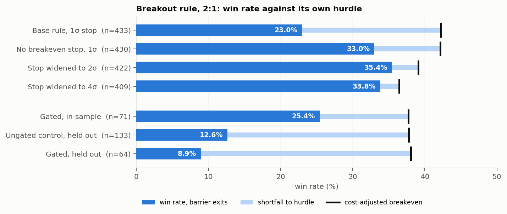

<sub>Regenerate with <code>python docs/make_breakout_figure.py</code>. Every row is recomputed from the backtest, and the gated configuration is re-chosen in-sample by the same function <code>gate_test.py</code> uses.</sub>

The hurdle is drawn per row, not as one reference line, because it
moves: it depends on cost as a share of stop distance. A single line
would hide the most useful thing in the picture, which is that the
bar comes *down* to meet a win rate that barely moves as the stop
widens.

### Where the strategy stands

Four tests, four negatives:

| test | result |
|---|---|
| Base rule, 1 sigma stop | 23.0% barrier win rate vs 42.2% hurdle, −125R, t = −5.02 |
| Stop widened to 4 sigma | −13.7R, t = −0.50 — all cost reduction, no edge |
| Zero cost | mean R +0.047, t = +0.81 — no gross edge in either direction |
| Risk gates, held out | −0.352 mean R, worse than ungated |

The honest summary is that the entry rule carries no directional
information, which is also what the daily VWAP/EMA signal measured
at a rank IC between −0.011 and +0.003. Widening the stop made it
cheaper to run a coin flip. The gates made the coin flip smaller.

**BACKTEST-ONLY. Not a recommendation to trade.**

### The one-shot test on unseen data

After sixty-odd configurations, one pattern had both a consistent
shape and an economic story. On 1-hour bars, shallow pullbacks
(33-50% of the impulse) did better than medium, and medium better
than deep. Before costs, shallow reached t = +1.77.

That pattern was found by *looking* at Sep 2024 - Sep 2026, so no
split of that period could test it cleanly. `prior_period_test.py`
runs it on **Sep 2022 - Sep 2024**, data nothing in this study had
touched. The rule and the pass criteria were committed in `c725e6e`
*before* the run. The redownloaded data was checked first against
the seen period and reproduced it (517 shallow trades vs 514,
zero-cost +0.106 vs +0.098).

|  | seen 2024-26 | **unseen 2022-24** |
|---|---|---|
| shallow, with costs | −0.006R, t −0.11 | **−0.078R, t −1.37** |
| shallow, zero cost | +0.106R, t +1.91 | +0.031R, t +0.55 |
| medium, zero cost | +0.074R | −0.028R |
| deep, zero cost | −0.002R | −0.005R |

**PRIMARY: FAIL.** **PATTERN: DOES NOT REPLICATE.** All four
instruments are negative with costs, and the depth ordering is gone.
The t = +1.91 in the seen period was what the best of sixty tries
looks like. It was noise that happened to line up with a plausible
story.

That closes this line of work. The breakout-retracement entry has no
directional information on these instruments at 15m, 30m or 1h, under
any bracket, filter or depth band tried. Full output is in
`results/prior_period_test_2022-2024.txt`.

### Signal-first: measuring information before building a trade

Every rule above failed for one reason: the entry carried no
directional information, and no bracket can create it. So the order
was reversed. `signal_research.py` measures whether a signal predicts
the next move *at all*, using rank IC per (instrument, month), tested
across months so overlapping 24-hour returns cannot inflate t. Holm
correction is applied across all 24 tests. Candidates, horizons,
split and pass criteria were committed in `ec1ecf1` before either
stage ran.

| stage | period | result |
|---|---|---|
| Discovery | Sep 2022 - Sep 2024 | 15 of 24 at naive p < .05 (≈1.2 expected by chance); **12 survive Holm** |
| Confirmation (one run) | Sep 2024 - Sep 2026 | **all 12 confirm**, same sign, mostly stronger |

**These are not twelve findings. They are one: intraday-to-daily
mean reversion.** Every survivor measures how far price has stretched
from a recent reference (the last 1-24 hours, the session VWAP, the
prior session's volume point of control), and every one says the
stretch partly reverses. On discovery data the reversal signals are
rank-correlated 0.50-0.74 with each other. Momentum, the London and
New York open drives, and the order-flow proxy do not survive.

Only two clear the pre-registered cost bar, both at a 24-hour horizon:

| signal | discovery IC | confirmation IC | quintile edge | round trip |
|---|---|---|---|---|
| 24h reversal | −0.058 | −0.083 (t −4.9) | 7.3 → 8.8 bp | 2 bp |
| prior-session POC reversion | +0.074 | +0.081 (t +5.5) | 10.3 → 8.0 bp | 2 bp |

At 1-4 hours the effect is real (t between 3 and 6.5) and far too
small to trade, at 0.04-1.9bp against 2bp. That is the other half of
the finding.

What this is **not** yet is a strategy. The quintile edge is a
long-top, short-bottom spread per 24-hour hold. A real position also
pays the **overnight financing (swap)** that a 1bp-per-side cost
model ignores, overlaps with the next day's signal, and has to be
sized. Short-term reversal in FX is a documented effect, not a new
one, so the prior is that it exists and is thin. The confirmation
block was also the period the breakout rules were tested on. These
signals were never measured there, but it is not virgin data in
every sense.

### What this still cannot tell you

Moving off Yahoo bought sample size, which is the difference
between a few dozen trades and a few hundred. It did not buy
certainty, and two limits remain:

The entry rule has **two fitted-looking free parameters** — the
retracement band and the wait — set from the shape of the idea
rather than from the data, but never yet held out. Until this
gets the same treatment `gap_test.py` gives the gap effect
(choose on the first two thirds, touch the last third once), a
positive result here means what every in-sample result in this
repository means, which is very little. That is the obvious next
step and it is not done.

And **costs dominate at this frequency**. The round trip is over
0.10R on a typical stop here. A rule that looks marginally
profitable at 1bp per side can be firmly unprofitable at 2, and
retail FX spreads at the moments this strategy trades are not
1bp. The cost assumption deserves more scepticism than the
signal.

**BACKTEST-ONLY. Not a recommendation to trade.**

---

## 6. `quant_metrics.py` — the original pipeline

The repository began as a compact rolling-metrics pipeline, and that
script is still here and still runs standalone:

```bash
python quant_metrics.py
```

It pulls daily closes from Yahoo Finance for whatever
`config.YAHOO_SYMBOLS` resolves to — the five ETFs, by default —
then computes a rolling 6-month (126-day) annualised Sharpe ratio
and a rolling 95% non-parametric historical VaR. Change the universe
in `config.py` and this script follows. It falls back to its own
hard-coded ticker list only if `config` cannot be imported, so it
still runs as a standalone file.

It has not been folded into `fxrisk/` because the two answer
different questions and the comparison is useful. `quant_metrics.py`
gives a fast rolling read on any Yahoo-listed instrument with three
dependencies and no estimation step. The engine below models the
volatility process explicitly, tests whether its risk numbers were
actually right, and works from local tick data rather than a vendor
API.

Where they overlap, the engine is the stricter of the two: rolling
historical VaR is exactly the estimator that passes Kupiec and fails
Christoffersen in §3, because a rolling empirical quantile cannot
react to a volatility regime change. That is not a criticism of the
original script — it is the finding that motivated the rest of this
repository.

---

## 7. Layout

```
fx-risk-engine/
├── quant_metrics.py             # original rolling Sharpe/VaR pipeline
├── config.py                    # every parameter
├── fetch_data.py                # daily bars; touches the network
├── fetch_intraday.py            # Dukascopy 15m bars; touches the network
├── run_risk_report.py           # the pipeline
├── paper_trade.py               # Alpaca paper broker, execution only
├── run_paper_daily.sh           # daily runner (launchd agent alongside)
├── barrier_test.py              # 1:1 bracket, measured
├── variants.py                  # conditioned variants and their win rates
├── calendar_probe.py            # do the event dates carry more volatility?
├── gap_test.py                  # overnight gap, with a HELD-OUT third
├── breakout_test.py             # breakout/retracement, 2:1, breakeven (§5a)
├── build_regime.py              # caches GARCH/VaR/correlation paths (§5a)
├── gate_test.py                 # risk gates, with a HELD-OUT third
├── fxrisk/
│   ├── indicators.py            # rolling VWAP, EMA, shifted signal
│   ├── calendar.py              # rule-derivable event flags
│   ├── data/
│   │   ├── yahoo.py             # daily cache reader, no network
│   │   ├── intraday.py          # Dukascopy cache reader, 17:00 ET sessions
│   │   └── histdata.py          # tick + M1 loaders, VWAP, sessions
│   ├── models/
│   │   ├── ewma.py              # RiskMetrics EWMA
│   │   ├── garch.py             # GARCH(1,1), normal or Student-t
│   │   └── dcc.py               # DCC-GARCH
│   ├── strategies/
│   │   ├── breakout_retrace.py  # session VWAP, breakout, retracement
│   │   └── regime.py            # GARCH / VaR / correlation gates
│   └── risk/
│       ├── var.py               # VaR + Expected Shortfall
│       ├── montecarlo.py        # FHS, parametric, bootstrap; term structure
│       ├── strategy.py          # risk of RUNNING a signal (§3)
│       ├── barriers.py          # target/stop/time exits, R multiples,
│       │                        #   explicit brackets + breakeven stop
│       ├── performance.py       # Sharpe, Sortino, drawdown
│       ├── correlation.py       # pairwise static vs EWMA vs DCC
│       ├── backtesting.py       # Kupiec, Christoffersen, Basel
│       └── stress.py            # dated historical scenarios
├── docs/
│   ├── diagrams/                # hand-drawn SVG: how the pieces fit
│   ├── figures/                 # generated from model output
│   ├── make_figures.py          # regenerates docs/figures/ 01-05
│   └── make_breakout_figure.py  # regenerates 06 from the intraday backtest
├── tests/
│   ├── test_risk_engine.py         # 70 tests
│   ├── test_strategy_risk.py       # 12 tests
│   └── test_calendar_barriers.py   # 20 tests
├── .github/workflows/ci.yml     # suite on 3.10-3.12 + offline guard
└── quant-portfolio/             # see §9
```

---

## 8. What the tests actually check

Not coverage for its own sake. Each test pins a property whose
silent failure would make output wrong in a way nobody would catch
by eye:

- **No look-ahead.** Perturbing the final return must leave every
  earlier forecast identical — for both EWMA and rolling GARCH.
  This is the most common backtest bug and the easiest to miss.
- **GARCH MLE recovers known parameters** from simulated series,
  including the Student-t degrees of freedom.
- **The independence test has nominal size**, checked across seeds
  rather than one lucky sample.
- **It has real power** against a flat VaR — and the aggregate
  framing documents that the power is limited.
- **Component VaR sums to total VaR** (Euler's theorem).
- **Stress replay reports partial coverage** instead of hiding it.
- **VWAP refuses to pass off a TWAP as a VWAP.**
- **A day-one loss shows up as a drawdown** — see below.
- **The breakeven stop arms at the close, not the intrabar high.**
  A bar that touches the trigger and reverses in the same fifteen
  minutes must take the original stop. The flattering version of
  this bug converts losers into scratches for free and is
  invisible until the rule is traded.
- **The breakeven stop also costs winners.** A trade that arms,
  retests entry and only then runs to target is a scratch, not a
  +2R. If that test ever passes with both at +2R, the stop is not
  really armed.
- **Overlapping entries are dropped, not stacked.** Counting three
  overlapping trades at one unit each levers the book past the
  risk the strategy claims to take.
- **A session VWAP resets at 17:00 ET, not midnight.** Grouping on
  the calendar date would reset it in the middle of the Asian
  session — the worst possible place. A second test asserts this
  is the same boundary `config.SESSION_CLOSE` gives the daily
  engine, so the two paths cannot silently diverge.
- **The intraday universe is instruments, not proxies.** EUR/USD
  means EUR/USD. Earlier drafts used currency ETFs and then CME
  futures as stand-ins, both forced by Yahoo's limits.

Bugs found by writing these tests rather than by reading the code:
the Basel zone being applied below 99%; Lopez loss collapsing into
a plain breach count on decimal returns (the quadratic term is
~1e-4 against a constant of 1); two test assertions that were
themselves statistically unsound; and the drawdown peak starting at
the wrong place.

### Two things the strategy tests caught in my own work

**The drawdown peak.** `drawdown_profile` took the running maximum
of the equity curve, whose first value is already after the first
return — so the starting capital was never a peak, and a strategy
that opened by losing half its money reported a drawdown of zero.
Caught by a test asserting that −50% followed by +50% is a 25% loss
rather than flat. The fix floors the running peak at initial
capital and is a no-op whenever the first move is upward.

**A claim that was backwards.** The strategy module argues that
fitting GARCH to a flat-heavy strategy series is wrong. I first
wrote that the flat days look calm and drag the variance *down*, so
the naive VaR comes out too low. The unconditional standard
deviation does fall — but the measured VaR is 1.18× to 1.79×
*higher*, because the atom at zero doubles the excess kurtosis,
which collapses the fitted degrees of freedom and pins persistence
to the IGARCH boundary. The docstring now carries the measured
table and the test checks the mechanism.

CI then caught me overreaching on the correction: it failed on
Python 3.11 while passing on 3.10 and 3.12, the signature of a
threshold sitting inside the noise. A ten-seed sweep showed the
*asset* fit also lands on the IGARCH boundary 2 times in 10, so
"the strategy fit is non-stationary and the asset fit is not" was
too strong, and a bound of 1.2× sat inside a range spanning
1.18–1.79. The test now asserts only what holds with a wide
margin.

### The leak the first version of these tests missed

`garch_var_series` originally estimated the Student-t degrees of
freedom **once on the full sample** and applied that single `nu` to
every historical quantile. The variance path was properly
walk-forward; the tail shape was not. Future data reached every
past VaR through the shape parameter rather than through the scale.

The original look-ahead tests could not see it. They perturbed the
last return and compared the *variance* series, which was honest.
Nothing checked the VaR series end to end.

Both are now estimated inside the rolling loop, and
`test_garch_var_series_is_not_forward_looking` compares the full
VaR frame against one computed on a truncated sample — the check
that would have caught it.

**Honest note on the size of the effect.** On simulated data with a
true `nu` of 4.5, the walk-forward estimate ranges 3.25 to 7.67
against a full-sample 4.28, and the resulting VaR differs by 1.1%
on average and 4.6% at most. The backtest verdicts were identical
before and after. So the bug was real but immaterial to any
conclusion drawn here. It is fixed because a reviewer who spots a
look-ahead leak discounts everything else in the repository, and
because the same class of error is not always this benign — not
because the numbers were wrong.

---

## 9. `quant-portfolio/`

A vendored copy of
[carlonimatteoo03/Quant_Portoflio](https://github.com/carlonimatteoo03/Quant_Portoflio)
by Matteo Carloni, MIT licensed — a VWAP strategy and mean-variance
portfolio construction. Kept separate because its portfolio
optimisation is in-sample by construction; see its own README.

---

## 10. Backtest-only results

**Everything this repository produces is a backtest.** It describes
what these models would have reported about the past. It is not a
prediction and not investment advice.

- **Nothing here is out-of-sample in the way that matters.** The
  scenario windows, the currency pairs and the model specifications
  were all chosen knowing what happened. Choosing to stress-test
  January 2015 is only possible because the SNB already moved.
- **Execution is ignored entirely.** No slippage, no funding, no
  market impact, no bid-offer beyond what tick data shows, and an
  implicit assumption that any position could be exited at the
  marked price. In every episode stress-tested here, that last
  assumption failed for somebody — that was largely what made them
  crises.
- **Passing a VaR backtest means adequate calibration over one
  sample.** It does not transfer to a different period, a different
  book, or a different market.
- **The strategy layer is the worst offender, and knows it.** The
  VWAP window and EMA span in §3 were chosen over the same sample
  they are evaluated on. Its reported drawdowns are therefore
  optimistic, not conservative. That the rule still loses money on
  four of five instruments is the finding; a version of it that
  looked profitable would have needed a great deal more scepticism
  than this repository applies.
- **Model risk is not quantified.** GARCH and DCC are assumptions.
  Their parameters carry estimation error the reported figures do
  not show, and stage-2 DCC standard errors ignore stage-1 error
  entirely.
- **The stress library is not exhaustive.** It contains episodes
  that happened. The event that matters next is, by construction,
  not in it.
- **Past performance does not indicate future results.**

Not investment advice. Not a solicitation to trade. No warranty of
any kind.

---

## 11. References

- J.P. Morgan / Reuters, *RiskMetrics Technical Document*, 4th ed., 1996
- Engle, R. (2002), "Dynamic Conditional Correlation", *JBES* 20(3)
- Kupiec, P. (1995), "Techniques for Verifying the Accuracy of Risk Measurement Models", *Journal of Derivatives* 3(2)
- Christoffersen, P. (1998), "Evaluating Interval Forecasts", *International Economic Review* 39(4)
- Lopez, J. (1999), "Methods for Evaluating Value-at-Risk Estimates", *FRBSF Economic Review*
- Basel Committee, *Supervisory Framework for the Use of Backtesting*, 1996; *Minimum Capital Requirements for Market Risk* (FRTB), 2019

## 12. Licence

MIT.
