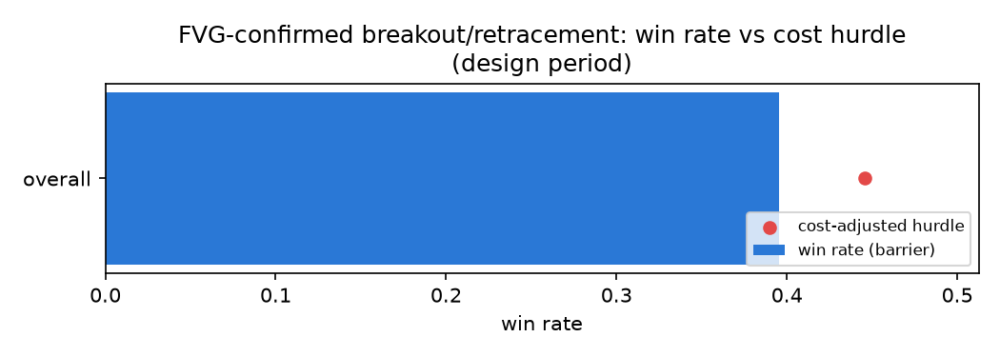

# DEMO_SIMULATED_FVG design-period results

Generated by `run_fvg_design.py`. Window: 2020-01-02 00:00:00+00:00 -> 2020-02-12 15:59:00+00:00 (60,000 1-minute bars).

Rule: VWAP/EMA trend filter + 20-bar breakout, 33%-100% retrace into a known fair value gap, 2:1, stop floor 1 EWMA sigma.

**BACKTEST-ONLY. Not a recommendation to trade.**

### Overall

| trades | win rate (barrier) | cost-adj. hurdle | gap | mean net R | total net R | t |
|---|---|---|---|---|---|---|
| 43 | 39.53% | 44.57% | -5.03% | -0.1509 | -6.49 | -0.66 |

